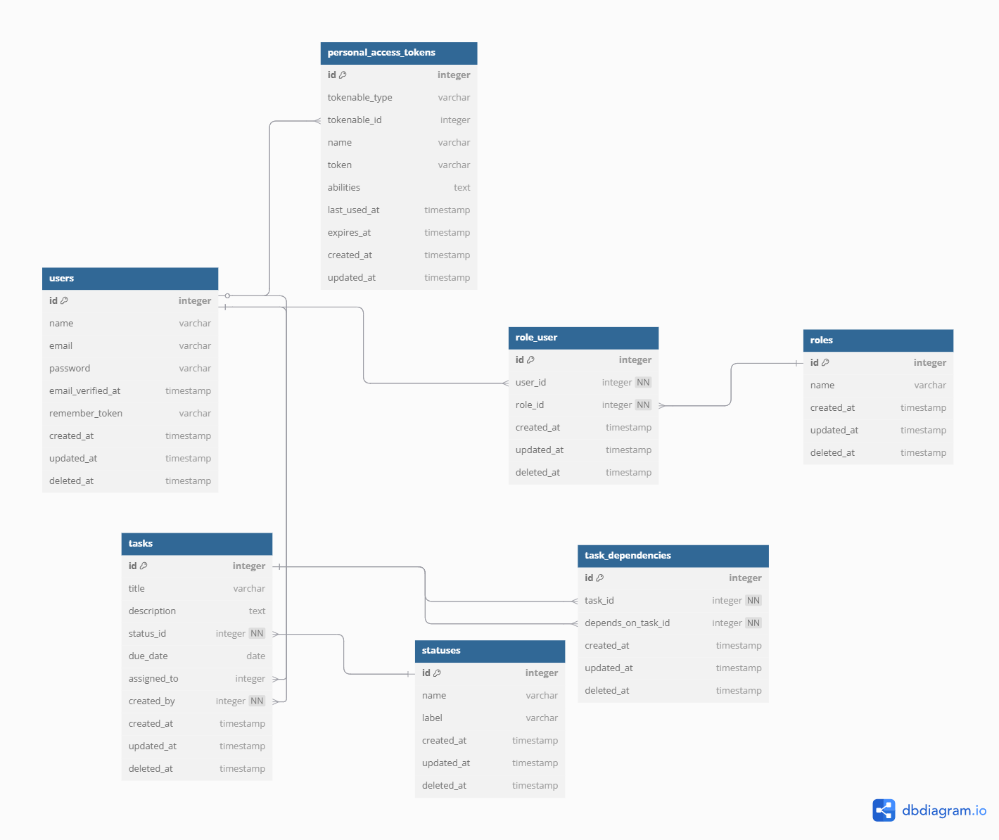

# Task Management System API

A robust RESTful API for task management with role-based access control, built with Laravel 12 and Docker.

## 🚀 Quick Start with Docker

### Prerequisites

-   Docker
-   Docker Compose

### Setup Commands

```bash
# 1. Clone the repository
git clone https://github.com/Marim99/task-management-system.git
cd task-management-system

# 2. Copy environment file
cp env.example .env

# 3. Build and start containers
docker-compose up -d --build

docker exec -it task_management_system bash
# 4. Install vendor
composer install
# 5. Generate application key
php artisan key:generate

# 6. Run migrations and seed data
php artisan migrate:fresh --seed

# 7. Set proper permissions
docker-compose exec app chown -R www-data:www-data storage bootstrap/cache
docker-compose exec app chmod -R 775 storage bootstrap/cache
```

### Access Points

-   **API**: http://localhost:8080
-   **phpMyAdmin**: http://localhost:8081
    -   Username: `laravel`
    -   Password: `secret`

## 📋 API Documentation

### Base URL

```
http://localhost:8080/api
```

## 👥 Seeded Users and Roles

### Roles

| ID  | Name    | Description                                          |
| --- | ------- | ---------------------------------------------------- |
| 1   | manager | Can create, update, delete, and assign tasks         |
| 2   | user    | Can only view assigned tasks and update their status |

### Users

| ID  | Name         | Email               | Password | Roles    |
| --- | ------------ | ------------------- | -------- | -------- |
| 1   | Manager User | manager@example.com | password | password |
| 2   | Regular User | user1@example.com   | password | password |
| 2   | Regular User | user2@example.com   | password | password |
| 2   | Regular User | user3@example.com   | password | password |
| 2   | Regular User | user4@example.com   | password | password |

### Statuses

| ID  | Name        | Label       |
| --- | ----------- | ----------- |
| 1   | pending     | Pending     |
| 2   | in_progress | In Progress |
| 3   | completed   | Completed   |

## 🔐 Role-Based Access Control

### Manager Permissions

-   ✅ Create tasks
-   ✅ Update task details (title, description, due date, assignee)
-   ✅ Delete tasks
-   ✅ Assign tasks to users
-   ✅ Set task dependencies
-   ✅ View all tasks with filtering

### User Permissions

-   ✅ View assigned tasks only
-   ✅ Update status of assigned tasks
-   ✅ View task details (if assigned)

## 🗄️ Database Schema

### Core Tables

-   **users**: User accounts with authentication
-   **roles**: Available roles (manager, user)
-   **role_user**: Many-to-many relationship between users and roles
-   **statuses**: Task status options
-   **tasks**: Main task data
-   **task_dependencies**: Task dependency relationships
-   **personal_access_tokens**: Laravel Sanctum authentication tokens

### Key Relationships

-   Users can have multiple roles
-   Tasks belong to one status
-   Tasks are assigned to one user
-   Tasks are created by one user
-   Tasks can have multiple dependencies
-   Tasks can be dependencies for other tasks

## 🛠️ Features

-   **RESTful API Design**: Follows REST conventions
-   **Role-Based Access Control**: Manager and User roles
-   **Task Dependencies**: Prevent circular dependencies
-   **Pagination**: All list endpoints support pagination
-   **Validation**: Comprehensive input validation
-   **Error Handling**: Proper HTTP status codes and error messages
-   **Authentication**: Laravel Sanctum token-based auth
-   **Docker Support**: Complete containerization

## ERD Diagram



## Postman Collection and Variables

### Import Files

-   **Collection**: [task_management_system.postman_collection.json](task_management_system.postman_collection.json)
-   **Environment**: [task_management.postman_environment.json](task_management.postman_environment.json)

### Setup Instructions

1. Import the collection file into Postman
2. Import the environment file into Postman
3. Select the "task_management" environment
4. Run the "login" request first to get an access token
5. The token will be automatically saved to the environment variable
6. All subsequent requests will use the saved token

### Environment Variables

-   `baseURL`: http://localhost:8080
-   `access_token`: Automatically set after login
